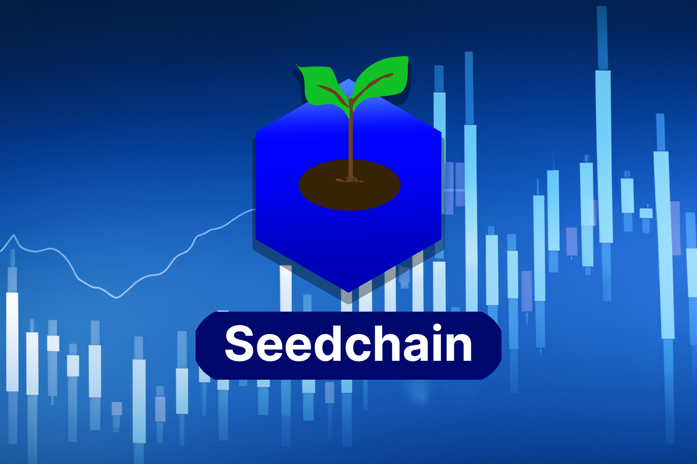

# Seedchain
 
_This project was made for Jamhacks 7._ Awarded Best Blockchain Hack.

Project Submission Link: https://devpost.com/software/seedchain

Video Demo: https://youtu.be/726wsAlkVMs

## Inspiration
We were inspired by our university friends, many of whom have had ideas for innovative side projects or micro startups that never saw the light of day. Many of these side projects had the potential to revolutionize the way we live and improve the financial situation of university students.

## What it does
Introducing _Seedchain_, the secure platform where individuals can confidently invest in micro startups and side projects. With its transparent and traceable environment, _Seedchain_ empowers university students and aspiring entrepreneurs by providing the necessary funding to drive their projects forward. Leveraging blockchain technology, _Seedchain_ ensures the safety, security, transparency, and traceability of all transactions through the decentralized splitting of company ownership. 

## How we built it
_Seedchain_ is built using Flask through Python. The front end was created using Tailwind CSS and various javascript scripts. We used the web3 library and solcx to create a blockchain on which transactions can be made to invest in the micro startups.

## Challenges we ran into
1. A major challenge we ran into was the recording of transactions on the blockchain. This is because we couldn't find any stable third party that we could learn to use and rely on for our product. We found a library that combines all our blockchain requirements together into our web application, but we couldn't implement due to a lack of credits.

2. Since _Seedchain_ heavily utilizes concepts from stock trading, we also faced challenges in programming investors' buy and sell orders. Mainly, we needed to design instant buys/sells as well as bids and asks into the same platform without relying on the fast supercomputers that do most trades on the stock exchange.

## Accomplishments that we're proud of
Our website allows for the transaction of shares on a public market in a traceable and transparent way using blockchain technologies. We're especially proud of how we allow startups to sell and see their company trade without undergoing the hassle of an initial public offering.

## What we learned
1. We had to learn, from scratch, how the blockchain works and how to host our own where we can write to it. This required the use of several libraries and their integration into a single full-stack web application.

2. When faced with challenges from our heavy inspiration of the stock market we were forced to learn about the stock market extensively and to create the proper algorithms for trading shares of a startup without relying on the computerized trading systems that the modern stock market is based on.

## What's next for _Seedchain_
We're dedicated to safeguarding the privacy of our users by implementing advanced security measures. As part of our expansion plans, we aim to enhance data protection by transitioning our JSON files to encrypted databases. This ensures that sensitive user information remains secure, offering an added layer of privacy and peace of mind for our valued community.

Before letting anyone create a startup on _Seedchain_, we're planning on having professionals check the legitimacy and vet for projects on the site to ensure that none of our investors get scammed. Additionally, this will come with a whole set of legal issues that we're working on solving.
